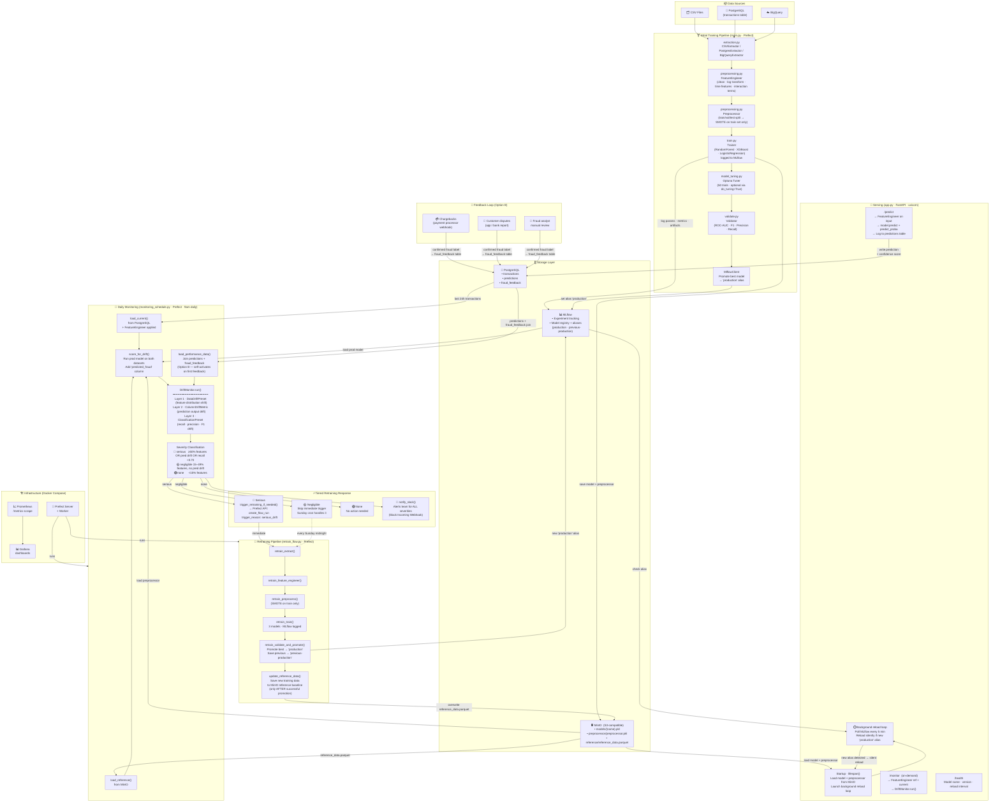

# End-to-End MLOps Pipeline — Fraud Detection

---

## Summary

| Stage | Trigger | Runs On |
|---|---|---|
| Initial Training | Manual | Prefect (one-off) |
| Serving | On request | FastAPI (always on) |
| Model reload | Every 5 min (background) | FastAPI lifespan task |
| Drift Monitoring | Daily 9am | Prefect cron |
| Slack alert | Every monitor run | Prefect task |
| Retraining (serious) | Drift ≥50% or prediction drift | Prefect (immediate) |
| Retraining (scheduled) | Every Sunday midnight | Prefect cron |
| Reference baseline refresh | After successful promotion | End of retrain_pipeline |
| Option B performance check | Self-activates on first feedback row | Monitoring flow |
